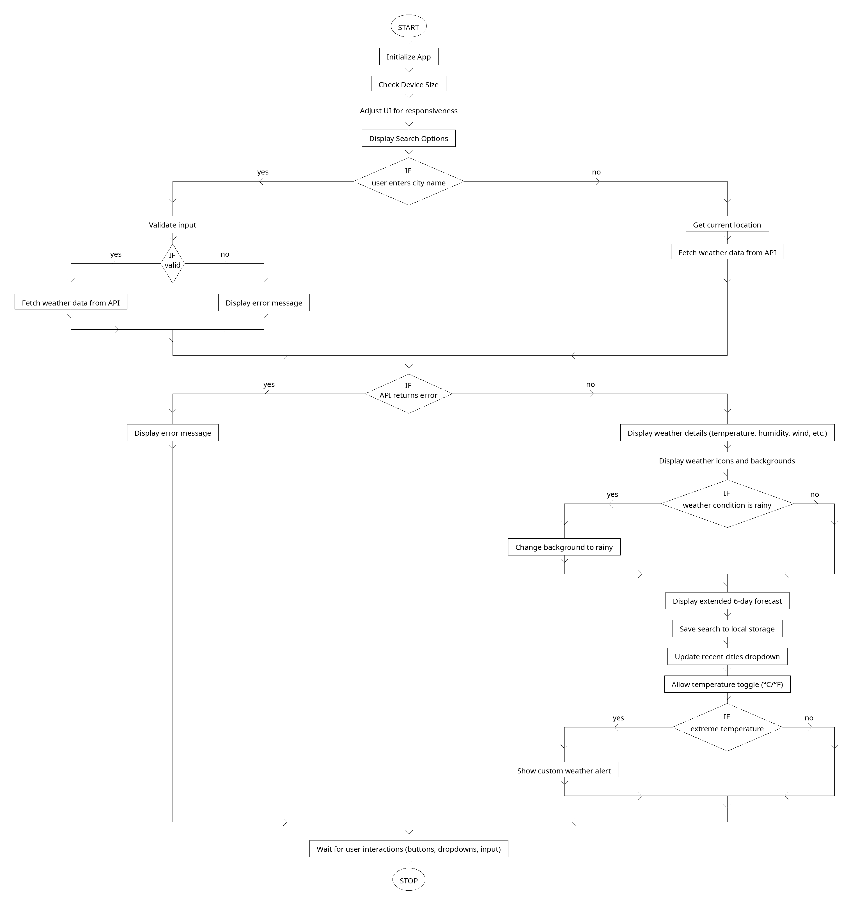

**Assignment:**

 **DailyWeather - Weather app** 

\
\
\
\

        ********

\
\
\

PROJECT OVERVIEW :

\
\

“**DailyWeather**” is a Weather App, Built as an ‘Progressive Web App’ . This Application is deployed in Netlify and can be installed as an app by going through the link. The app is fully designed/tested for Web & Mobile responsive.

This Web-App comprises of the following functionalities: - 

- Consumes WeatherAPI to give weather related information.

- Fully responsive for various screen sizes (desktop, iPad Mini, iPhone SE).

- Allows users to search for weather forecasts by city name.

- Allow users to search weather forecasts for their current location.

- Added user interaction features such as buttons and input fields for selecting locations and viewing different weather data.

- Implemented a dropdown menu for recently searched cities using Local Storage.

- Implement event listeners to handle user interactions and update the UI accordingly.

- Validation of user inputs to prevent errors.

- Fetching and displaying location-specific weather forecasts (e.g., temperature, humidity, wind speed, etc) for a user's location.

- Implemented temperature unit toggle (°C/°F). 

- Implemented custom weather alerts for extreme temperatures.

- Used appropriate icons or graphics to represent weather conditions (e.g., sunny, cloudy, rainy. If the weather condition is rainy, then it turns into a rainy background dynamically.

- Implemented functionality to display extended weather forecasts for multiple days (e.g., 6-day forecast). 

- Organized forecast data into a visually appealing and easy-to-read format. (date, precipitation, wind, and humidity information with relevant icons for temp, wind, and humidity in each card).

- Handled API errors gracefully by displaying appropriate error messages to users.

\
\
\

         Github open source : <https://github.com/chaitali9497/daily-weather>   

         Netlify deployment : <https://daily-weather-pwa.netlify.app/>       

         Design inspiration : <https://dribbble.com/shots/25341218-WeatherJ>   

\

PROJECT STRUCTURE :

DAILY-WEATHER-APP/

├── node\_modules/         

├── src/

│   ├── icons/             (weather icons)

│   ├── images/         (backgroud images)

│   │   ├── cloudy.jpg     

│   │   ├── fog.jpg        

│   │   ├── rain.png       

│   │   ├── snow\.jpg       

│   │   ├── sunny.jpg      

│   │   └── thunder.jpg    

│   ├── JS/

│   │   └── index.js       

│   ├── # input.css        

│   ├── # output.css       

│   ├── service-worker.js  

│   └── .gitignore         

├── index.html             

├── manifest.json          

├── package-lock.json      

├── package.json           

├── postcss.config.mjs     

└── README.md              

\
\
\
\
\
\
\
\
\
\
\
\
\

PROJECT FLOW :

\
\
\

APP USER INTERFACE :

\
\
\
\
\
\
\

                                                                                
